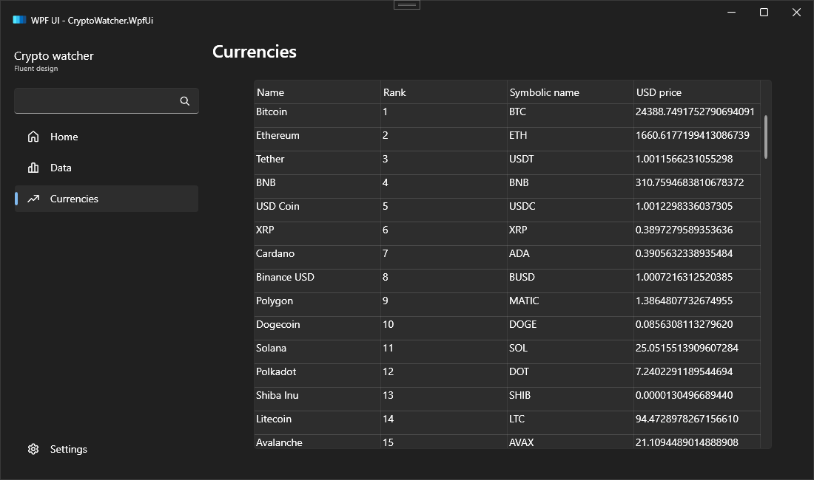
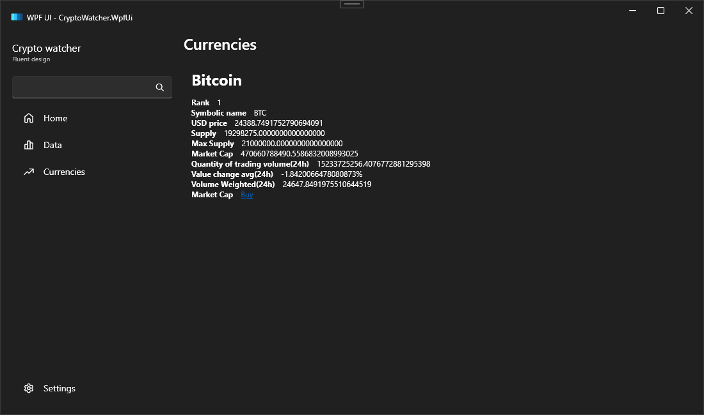

# CryptoWatcher

.NET 7, <a href="https://github.com/lepoco/wpfui/tree/main">WPF UI Framework</a>, free open API docs.coincap.io

MVVM, DI present

Design is very human, easy to use

 

Some code made by <a href="https://openai.com/blog/chatgpt/">ChatGPT</a>, a lot of suggestions ware taken from chat

Home and Data pages is from template, i didn't remove them just for saving unnecessary items in nav bar to keep them not empty

Light and dark theme support, not dynamic, without saving state, just basic framework feature

Search bar not implemented, it's part of template

EN and UK languages, not working as proper, exists issue with resource cleaning, but it can be easily fixed

